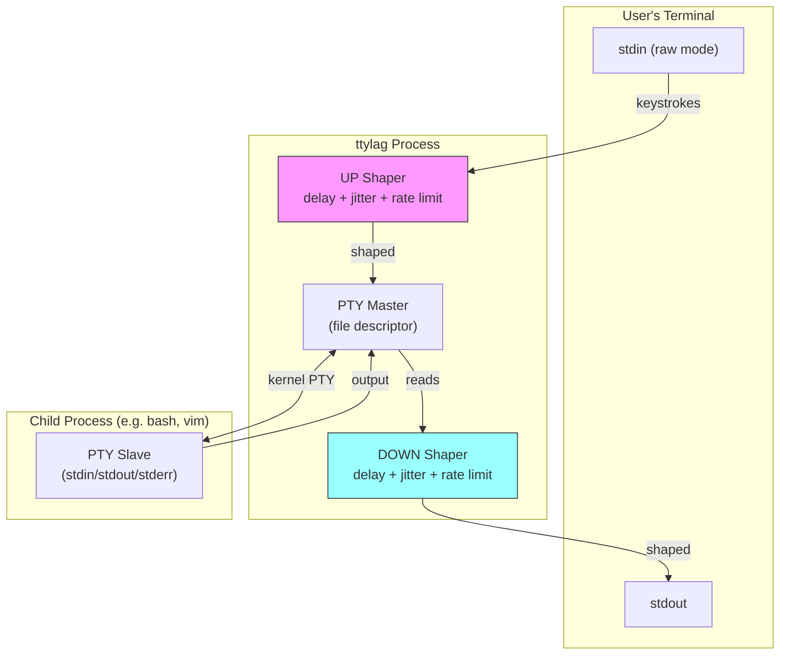
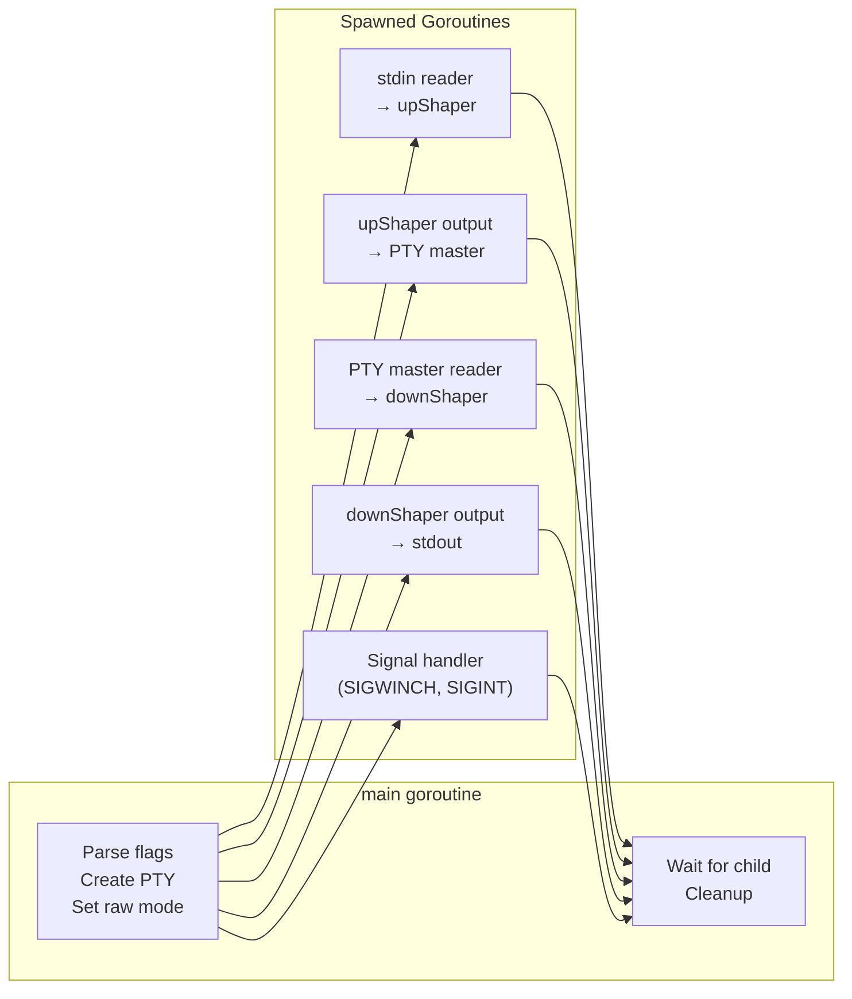
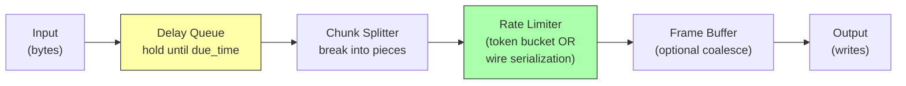
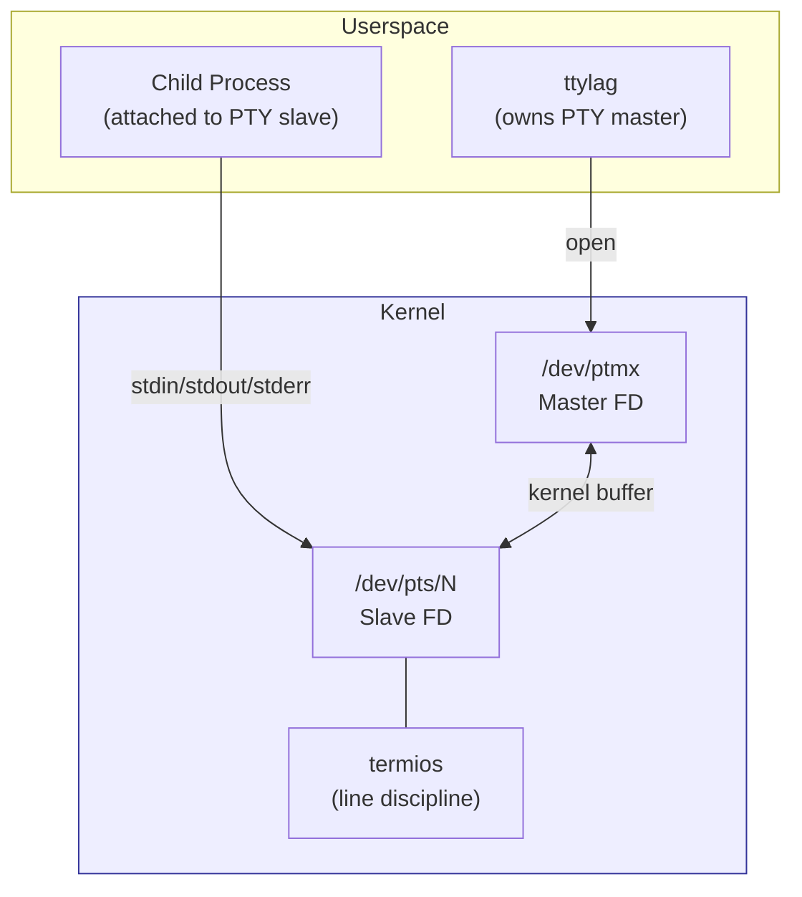
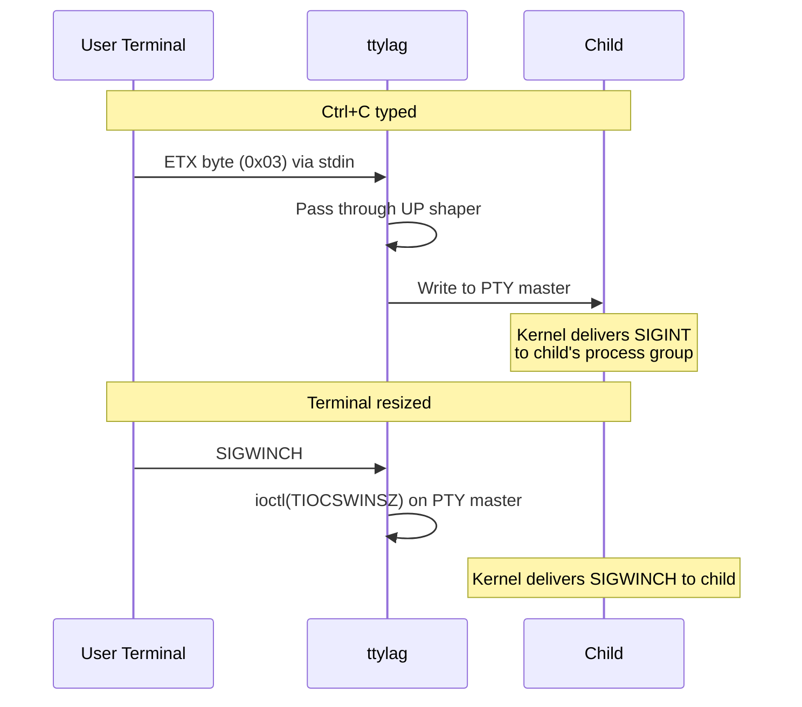
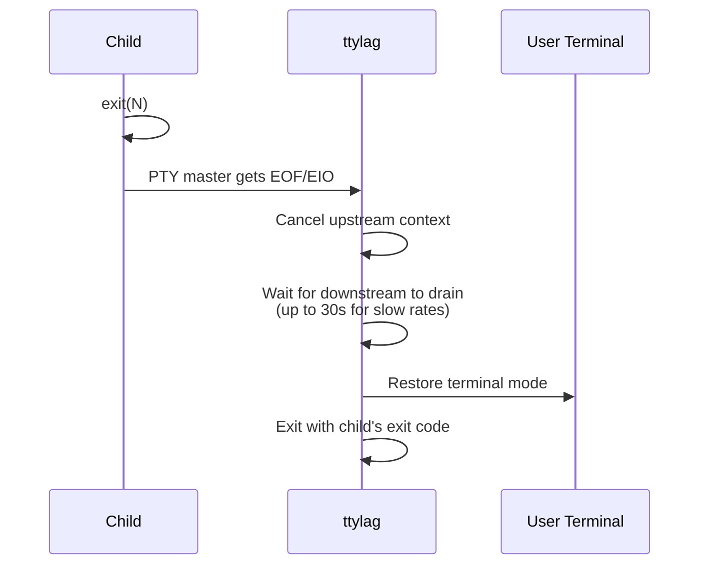

# ttylag Architecture

High-level architectural overview for new developers.

## Overview

ttylag is a PTY (pseudo-terminal) wrapper that simulates slow/laggy network connections or the archetypal serial console experience. It sits between your terminal and a child process, applying configurable delays and bandwidth limits.

## 1. Data Flow Diagram

**Key insight**: The PTY master and slave are connected by the kernel. ttylag controls the master side; the child process sees the slave as its terminal.

## 2. Process & Goroutine Structure

## 3. Shaper Pipeline (per direction)

Each shaper processes data through these stages:

**Two rate limiting modes:**
- **Token Bucket** (default): Bursty output, like packet networks
- **Serial Mode** (`--serial`): Smooth byte-by-byte, like RS-232

## 4. PTY Mechanics (OS Level)

**What the kernel does:**
- Provides bidirectional byte stream between master/slave
- Handles terminal window size (TIOCSWINSZ)
- Line discipline (echo, signals) happens at slave side

**What ttylag does:**
- Opens PTY master, forks child on slave
- Puts user's terminal in raw mode (bypass line discipline)
- Intercepts all I/O through the master fd

## 5. Signal Flow

**Key point**: Control characters (Ctrl+C, Ctrl+Z) flow through ttylag as raw bytes because the user's terminal is in raw mode. The PTY slave's line discipline converts them to signals for the child.

## 6. Shutdown Sequence

## Quick Reference

| Component | File | Purpose |
|-----------|------|---------|
| CLI & orchestration | `main.go` | Flag parsing, PTY setup, signal handling |
| Traffic shaping | `shaper.go` | Delay, jitter, rate limiting, chunking |
| Connection profiles | `profiles.go` | Preset configurations (3g, dialup, etc.) |

## Further Reading

- `DESIGN.md` - Detailed design decisions and rationale
- `AGENTS.md` - Development conventions and testing
